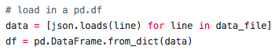
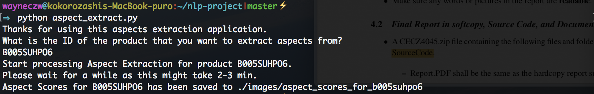
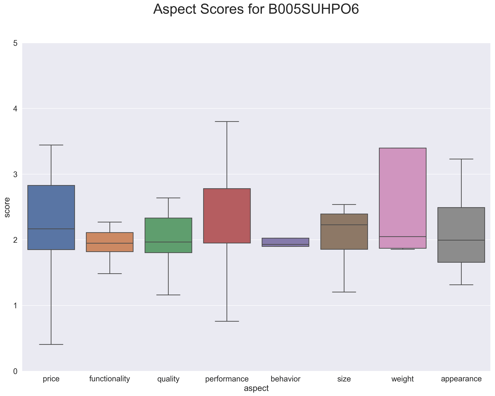

# nlp-project

# Set up Environment
Python 3.5.2 is the main language used in this codebase.

	pyenv install 3.5.2  # Install Python version

I strongly encourage the use of Python [virtual environments](http://docs.python-guide.org/en/latest/dev/virtualenvs/):

    virtualenv venv -p /Users/{your_own_user_name}/.pyenv/versions/3.5.2/bin/python3.5
    source venv/bin/activate

# Install all required Packages
After which, simply install all the required python modules via

    pip install -r requirements.txt
(here I'm just putting some of the commonly used modules here, there are lots more out there)

# Packages/Libraries used for this project
## pandas
We use pandas as the Data structure to hold the product review dataset. Specifically, we load in the Json product review dataset into a Pandas Dataframe code:

The variable ‘df’ is a Pandas Dataframe that would contain information of  all the reviews in a tabular format. The columns in ‘df’ will correspond to the different attributes in a product review. The rows in ‘df’ will correspond to the different product reviews.

Using Pandas library’s Dataframe object is ideal in handling the tasks in this assignment because we are able to apply built-in Pandas functions such as counting unique items, and automatically sort them according to the counts of unique items. 

## nltk
nltk is a great natural language toolkit that provides a comprehensive set of API that can be used for many NLP tasks.

In this assignment, the following nltk API are used:

#### tokenize.sent_tokenize AND tokenize.casual.EMOTICON_RE AND tokenize.TweetTokenizer
>	We use **sent_tokenize** to do a first round of sentence segmentation.  We then apply **EMOTICON_RE**, a regular expression object imported from nltk, onto each of the segmented sentences. The reason for this is that we want to find whether a segmented sentence contains an emoticon(s), and if so, we want to further segment the sentence into two parts – a part containing the emoticon, and the other part not containing the emoticon. This is because we want to treat “This product is great :) But the product is also pretty expensive” as two separate sentences, but **sent_tokenize** will actually treat it as a single sentence. The **TweetTokenizer** will then be used to aid the sentence segmentation process, such that all emoticons will be treated as the end of the sentence. For example, *I love it <3 it's perfect* will be segmented into [*I love it <3*, *it's perfect*].

#### tokenize.treebank.TreebankWordTokenizer AND tokenize.EMOTICON_RE AND tokenize.casual.\_replace_html_entities
>	We customised a **ReviewTokenizer** class by extending nltk's **TreebankWordTokenizer**, which is augmented to be flexible and easy to adapt to online domains. The tokenizer uses regular expressions to conduct transformations and to tokenize text as in Penn Treebank. Certain well-known features were retained such as handling of quoted strings and splitting of commonly used contractions like “don’t” into “do n’t”.  Although robust, preliminary results show that the TreebankWordTokenizer fails to tokenize emoticons correctly due to conflicts arising from the parsing of punctuations as separate tokens. This easily inflated the average number of tokens per sentence as it was reading emojis as multiple punctuations i.e. “:-)” as “:”, “-” and “)”. Thus, ReviewTokenizer will override and modify the parsing of punctuations used by TreebankWordTokenizer such that emojis will not be tokenized into multiple punctuations. 

>	The ReviewTokenizer also performs additional steps that further enhance the tokenization process. In particular, the new tokenizer fixes HTML character entities by replacing them with the parsed characters and also handles the correct tokenization of emojis as described above.

#### corpus.stopwords
>	We adopted the standard stopwords list from nltk, and add in slight modifications to better suit the online review texts:

>	STOPWORDS = set(stopwords.words('english') + ["'ve", "'d", "'s", "one", "use", "would", "get", "also"]) - {'not', 'no', 'won', 'more', 'above', 'very', 'against', 'again'}

#### stem.snowball.SnowballStemmer
>	**SnowballStemmer** is chosen instead of Porter Stemmer, because Snowball Stemmer, which is also called Porter 2, is an improved version of the latter and has faster computation time and more reliable results.

#### pos_tag
>	**pos_tag** is a very convenient tool provided by nltk, such that we can use it to do pos tagging on the online review texts.

#### RegexpParser
>	To identify and extract noun phrases from all reviews, A noun phrase detector is developed with **RegexpParser**, which is a grammar based chunk parser. A set of regular expression patterns are used to specify the rules of the parser. The parsing is based on the POS tagging results with **pos_tag** function on the full dataset which has been tokenized with our our tokenizer.

#### corpus.wordnet
>	**wordnet** is used to help us build the aspect sentiment analysis application (which rely heavily on IAC, refer to below for description on IAC), whereby the synonyms and antonyms are retrieved to increase the support of sentiment tokens in each online review, so that more accurate aspect analysis can be given.

## Implicit Aspect Clues (IAC)
>	We adopted and implemented the methodology from works of (Poria)[https://pdfs.semanticscholar.org/7dec/03bcf97f2440e4178f574aa5dcc8b7bee7e8.pdf] and focuses on extracting the implicit aspect clue (IAC) of the reviews.

>	At the same time, we have also tapped on the implicit aspect corpus developed by (Cruz-Garcia et al)[http://sentic.net/aspect-parser.pdf], where IACs are indicated and manually labeled by their corresponding aspect categories.

## sklearn
#### feature_extraction.text.TfidfVectorizer
>	We are tasked to find out the top 10 representative noun phrases for each of the top 3 frequent products, and **TfidfVectorizer** is used to help us compute the representative score.

## pyplot
pyplot provides a MATLAB-like plotting framework. We use the pyplot API to plot figures in this task

# To run the nlp application, which is designed for section 3.5 of the assignment
TO run the code, simply cd to the directory where [aspect_extract.py](./aspect_extract.py) locates, and enter the following into the terminal:
	
	python aspect_extract.py

After which, you will be prompted to enter a product ID, and our application will output an figure plotting the aspect sentiment scores:

# To run the code for section 3.2 to 3.4 of the Assignment
To run the code, simply cd to the directory where [main.py](./main.py) locates, and enter the following into the terminal:

	python main.py -i data/CellPhoneReview.json

This python script will run seamlessly.

### Sample outputs
Once started running [main.py](./main.py), there will be 3 types of outputs:

	1. Plots - which can be found in the folder figures.
	2. CSV file - which can be found in the folder rep_words.
	3. Terminal Printouts - which are literally printouts on the terminal.

### Example of sample outputs
#### Q1 Dataset Analysis
###### Popular Products and Frequent Reviewers
The outputs for this section will be 1 terminal printout that shows the top 10 products by frequency:

and 1 terminal printout that shows the top 10 reviewers by frequency:

###### Sentence Segmentation
The outputs for this section will be 1 plot that shows the distribution of segmented sentences:

and 1 terminal printout showing sample segmented sentences from 2:

###### Tokenization and Stemming
The outputs for this section will be 1 plot that shows the distribution of number of tokens per review (with and without stemming):

and 2 terminal printouts showing the top 20 frequent tokens (with and without stemming):

###### POS Tagging
The output for this section will be 1 terminal printout that shows the result of POS tagging on 5 randomly sampled reviews:

#### Q2 Development of a Noun Phrase Summarizer
The outputs for this section will be 2 terminal printouts that show the top 20 frequent Noun Phrases, the top one including single-word phrases, and the bottom one excluding single-word phrases:

and 3 termnial printouts that show the top 10 representative Noun Phrases for each of the top 3 frequent products by tfidf:

#### Q3 Sentiment Word Detection
The outputs for this section will be 4 CSV files, whereby all of them have the format (word, sentiment_score), a sample of the csv file is as follow:

	love,5242.0275
	great,5206.094
	works,3192.8250000000003
	fits,2593.849
	price,2590.8315000000002
	perfect,2524.384
	easy,2514.994
	good,2295.8885
	well,2240.1
	nice,2236.119
	...
	...
	stopped,-1526.4405
	disappointed,-1570.3305
	work,-1780.0149999999999
	return,-1909.5684999999999
	cheap,-2503.7245000000003
	broke,-2810.4155
	money,-3181.8645
	waste,-3525.3645
	not,-4235.419

