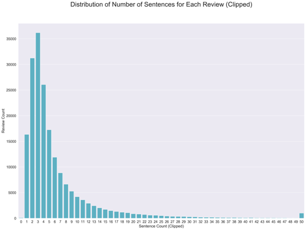

# nlp-project

# Set up Environment
Python 3.5.2 is the main language used in this codebase.

	pyenv install 3.5.2  # Install Python version

I strongly encourage the use of Python [virtual environments](http://docs.python-guide.org/en/latest/dev/virtualenvs/):

    virtualenv venv -p /Users/{your_own_user_name}/.pyenv/versions/3.5.2/bin/python3.5
    source venv/bin/activate

# Install all required Packages
After which, simply install all the required python modules via

    pip install -r requirements.txt
(here I'm just putting some of the commonly used modules here, there are lots more out there)

# To run the code
To run the code, simply cd to the directory where [main.py](./main.py) locates, and enter the following into the terminal:

	python main.py -i data/CellPhoneReview.json

This python script will run seamlessly.

# Sample outputs
Once started running [main.py](./main.py), there will be 3 types of outputs:

	1. Plots - which can be found in the folder figures.
	2. CSV file - which can be found in the folder rep_words.
	3. Terminal Printouts - which are literally printouts on the terminal.

### Example of sample outputs
#### Q1 Dataset Analysis
###### Popular Products and Frequent Reviewers
The outputs for this section will be 1 terminal printout that shows the top 10 products by frequency:

and 1 terminal printout that shows the top 10 reviewers by frequency:

###### Sentence Segmentation
The outputs for this section will be 1 plot that shows the distribution of segmented sentences:

and 1 terminal printout showing sample segmented sentences from 2:

###### Tokenization and Stemming
The outputs for this section will be 1 plot that shows the distribution of number of tokens per review (with and without stemming):

and 2 terminal printouts showing the top 20 frequent tokens (with and without stemming):

###### POS Tagging
The output for this section will be 1 terminal printout that shows the result of POS tagging on 5 randomly sampled reviews:

#### Q2 Development of a Noun Phrase Summarizer
The outputs for this section will be 2 terminal printouts that show the top 20 frequent Noun Phrases, the top one including single-word phrases, and the bottom one excluding single-word phrases:

and 3 termnial printouts that show the top 10 representative Noun Phrases for each of the top 3 frequent products by tfidf:

#### Q3 Sentiment Word Detection
The outputs for this section will be 4 CSV files, whereby all of them have the format (word, sentiment_score), a sample of the csv file is as follow:

	love,5242.0275
	great,5206.094
	works,3192.8250000000003
	fits,2593.849
	price,2590.8315000000002
	perfect,2524.384
	easy,2514.994
	good,2295.8885
	well,2240.1
	nice,2236.119
	...
	...
	stopped,-1526.4405
	disappointed,-1570.3305
	work,-1780.0149999999999
	return,-1909.5684999999999
	cheap,-2503.7245000000003
	broke,-2810.4155
	money,-3181.8645
	waste,-3525.3645
	not,-4235.419

#### Q4 Application
The output for this section will be 1 box plot that shows the distribution of sentiment of different key aspects of the product:

